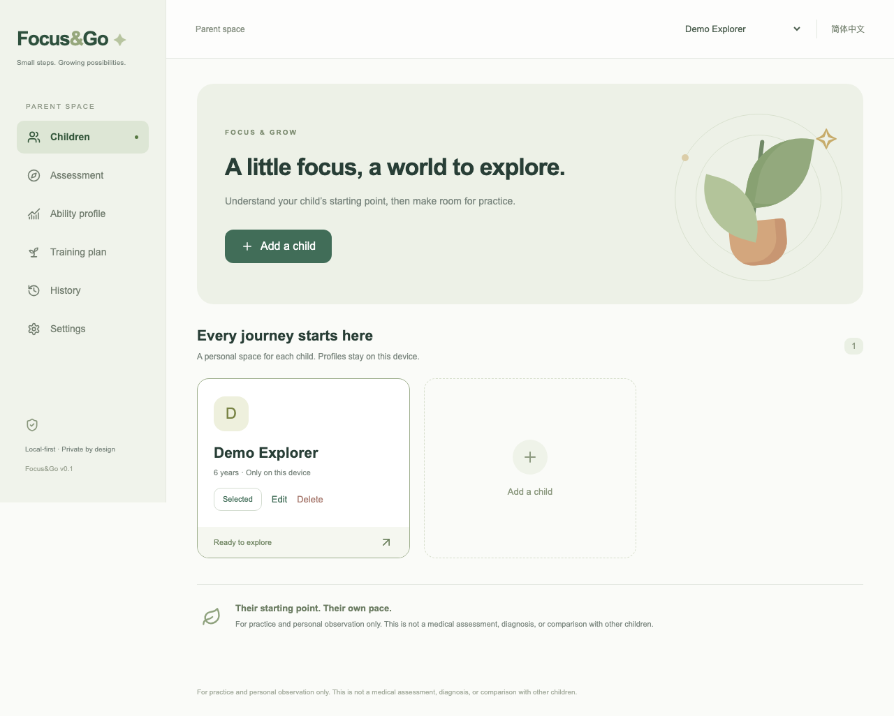

# Focus&Go

**小小一步，慢慢成长。** 面向 **5–8 岁**儿童的开源注意与执行功能结构化练习框架及参考应用。

[English](README.md) · [架构](docs/architecture.md) · [协议](docs/probe-protocol.md) · [研究依据](docs/research/psytoolkit-paradigms.md)

> v0.1 是实验性演示。个人基线仅表示孩子在固定版本协议下的自身起点，不是医学诊断、ADHD 筛查、人群常模或专业评估的替代品。系统不计算虚构的综合专注分，也不进行同龄排名。

## 快速启动

要求 Node 22.12+、npm。在当前 `Focus&Do` 仓库根目录执行：

```sh
npm install
cp .env.example .env
npm run dev
```

打开 **http://127.0.0.1:5173**。一条命令同时启动前端和 3001 端口的本地 BFF。无需 API 密钥也能使用全部基线与内置训练功能。克隆时请使用实际仓库地址，本项目没有预设发布地址。

```sh
npm run lint
npm run typecheck
npm test
npm run build
npx playwright install chromium
npm run test:e2e
```

本地构建预览：`npm run build && npm start`，打开 http://127.0.0.1:3001。不要在未经身份认证和安全加固的情况下公开部署。

## 演示流程

添加孩子 → 开始个人基线 → 说明/示范/练习/正式任务 → 能力画像 → 点击“为什么？”查看指标、规则和文献 → 选择并锁定训练方向 → 准备内容 → 完成有限时长的训练。支持暂停恢复、中文/英文切换、历史趋势与完整 JSON 导出。连续两轮练习未确认理解时，跳过正式任务并在报告说明。



六类活动分别观察持续注意、选择性注意、反应抑制、空间工作记忆、规则转换和多步指令执行。每类独立呈现原始指标，没有总分。首次完整评估保存为个人基线，后续同版本评估只与该孩子自身比较。

## 架构与 AI

原则：**AI 生成内容，框架定义机制；先确定性评分，再解释。** React + TypeScript 前端，Dexie/IndexedDB 本地仓库，Express BFF 仅代理 AI。固定版本的六类基线试次完全不依赖 AI。

服务端 `.env`：

```dotenv
FOCUSGO_LLM_BASE_URL=https://api.deepseek.com
FOCUSGO_LLM_API_KEY=
FOCUSGO_LLM_MODEL=deepseek-flash
```

2026-09-29 核对 DeepSeek 官方文档。模型、地址均可替换；修改后重启。密钥不进入浏览器、不使用 VITE_*。AI 只能填主题、短标签、温和提示和既有物品排列，不能改变答案、时序或比例。结果经过 JSON、语义与任务约束校验，失败重试一次后回退内置内容。调用保留提示词版本及校验记录，所有提示词用英文编写。报告采用受控表达和有效证据引用，拒绝编造结论。

## 隐私、局限与项目状态

档案、事件、试次和评估存于当前浏览器，清除浏览器数据会删除它们，请定期导出。仅用户触发 AI 操作时发送必要参数或最小证据包；不发送昵称、出生年月及完整行为历史。无广告、遥测、外部字体、相机或麦克风输入。

v0.1 可运行，但尚未经过儿童可用性研究、临床验证或训练效果验证。浏览器计时、运动能力、规则理解、小样本和中断均影响结果。原任务研究不自动证明本改编版本有效。[局限](docs/limitations.md)中详述；`/dev` 仅开发环境可用。正常运行不会自动制造演示评估数据。

PsyToolkit 是研究与参考实现目录，Focus&Go 独立实现，未复制其源码、图片、措辞或人群常模。各任务文献单独列明。

欢迎参阅[贡献指南](CONTRIBUTING.md)、[行为准则](CODE_OF_CONDUCT.md)、[安全说明](SECURITY.md)。采用完整原文 [Apache-2.0 许可证](LICENSE)。

当前 v2 每项为 8–12 道正式／训练题，基线含练习及一次补练最多 20 题。反应抑制采用交通灯 SVG，持续注意采用星空观察。旧 v1 会话可继续恢复，个人基线按协议版本分别保存与比较。
