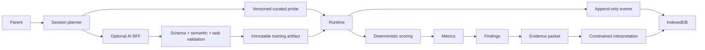

# Architecture

The repository root is the application root. `src/core/types.ts` defines the portable domain contracts. Domain scoring receives values, never browser/database handles. `src/data/repositories.ts` implements browser persistence behind named repositories. `server/provider.ts` isolates the OpenAI-compatible transport and server-side keys.

Only parent and child surfaces exist. The development-only `/dev` inspector is excluded by the production build flag. Sessions capture protocol versions, seeds, content artifacts, results and cursors. Completion computes metrics and findings from non-practice results. UI displays raw measurements and descriptive rules without a composite score.

The BFF binds to 127.0.0.1. A production hosted service is deliberately out of scope. Static assets can be served with `npm start` after building. No runtime CDN or font service is necessary.
