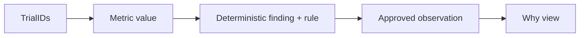

# Evidence and Why

Evidence IDs bind taskRunId, metric name, value and contributing formal timing-valid trial IDs. Findings carry stable IDs, translation keys, evidence references and the exact descriptive rule. EvidencePacket contains age, protocol, domain, metrics, findings and evidence; no nickname, birth month or raw historical log.

Every significant displayed finding opens Why, showing task/probe, metric values, rule, construct context, normative status and primary references. Raw metrics are expandable. Invalid/insufficient data is disclosed. AI observations must cite the references belonging to their exact finding and use an approved statement verbatim. A valid-looking citation does not authorize free-text extrapolation.
